# 事件传递分析

Android中事件传递使用的是**责任链模式**。
举例：一个互联网公司有总经理、经理、开发组长、程序员。当总经理提出开发需求后，会将开发任务分发经理、经理分发开发组长，开发组长分发给程序员。
* 当程序员可以完成任务时，完成后告知开发组长，开发组长告知经理，经理告知总经理。这样一次开发需求完毕。
* 当时当程序员无法完成时，同样告知开发组长任务无法完成，这时就需要开发组长来完成；若开发组长也完成不了，那么就一级一级网上报，直到任务发成或者总经理自己看着办。

同样的，在事件传递中，分发事件的方法是**dispatchTouchEvent(MotionEvent event)**，上一级与下一级的事件交流都是通过这个方法，而**onInterceptTouchEvent(MotionEvent event)**方法和**onTouchEvent(MotionEvent event)**方法都是在dispatchTouchEvent方法中调用的。

下图是事件传递的基本流程：
箭头上的序号为传递的选后顺序。

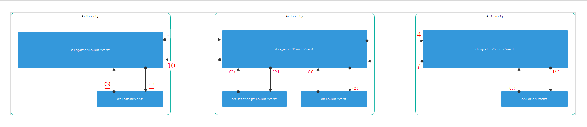

## 事件传递的几种情况

由于上图不便于标示分析，下面的示意图都会讲onInterceptTouchEvent/onTouchEvent方法提到与dispatchTouchEvent平级来进行分析。
我们测试的demo中，Activity中只有一个ViewGroup、ViewGroup中有一个View。

控制事件流的方法有：
* dispatchTouchEvnet
* onInterceptTouchEvent
* onTouchEvent

先抛出四条结论，在下面例子中验证：
* 事件往下传递的过程就是找消费该事件的View的过程
* 在down事件中，每层级ViewGroup在寻找接收down事件的TargetView（可以时子控件，后者本身）
* 只有在dispatchTouchEvent和onTouchEvent方法中才能确定该层级的TargetView
* 只能在onInterceptTouchEvent方法中才能修改TargetView且修改时会发送cancel事件给之前的TargetView，并且将该次事件交由Activity。后续的事件就不会执行该方法
* 如果确定了TargeView，dispatchTouchEvent和onTouchEvent返回false，那么本次事件交由Activity
* 若果没有确定TargetView，dispatchTouchEvent和onTouchEvent返回false，那么事件交给父控件。

### 所有事件控件方法都返回默认值
**down事件**的传递流程


**move/up事件**的传递流程

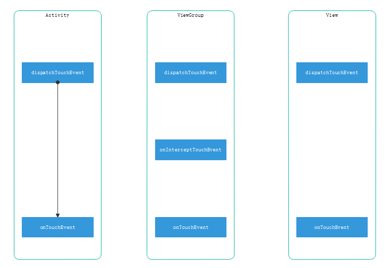

### View的onTouchEvent返回true

**down事件**的传递流程

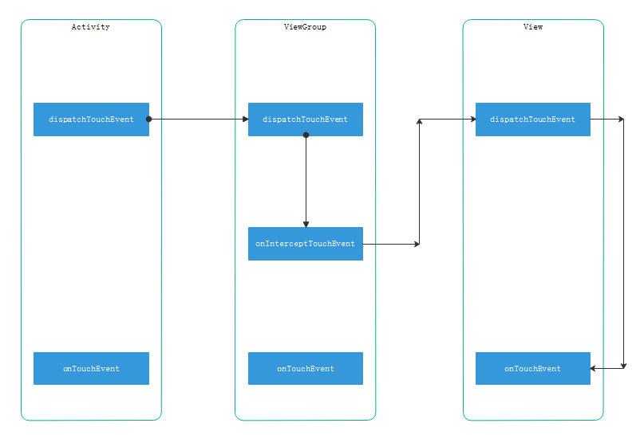

**move/up事件**的传递流程
与down一样

### ViewGroup的onTouchEvent返回true

**down事件**的传递流程

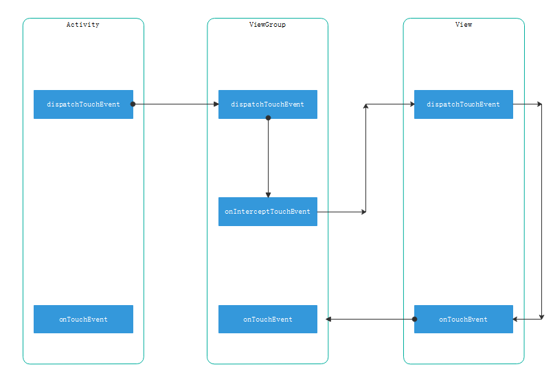

**move/up事件**的传递流程

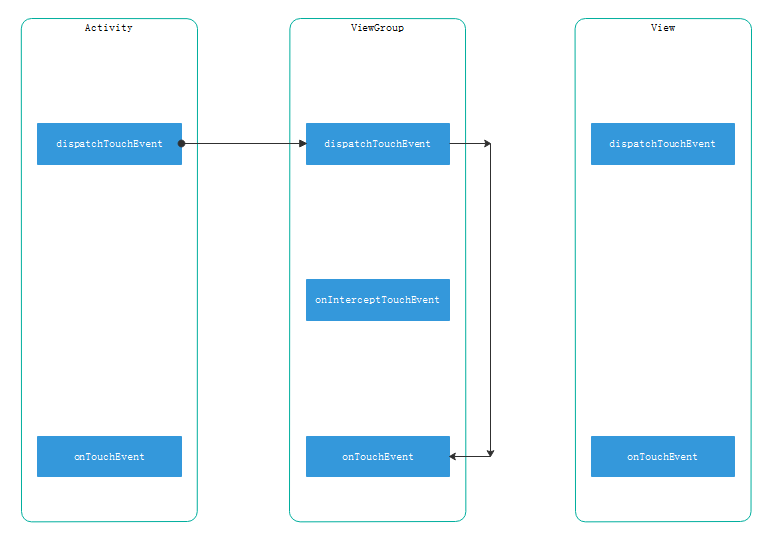

### View的onTouchEvent返回true

**down事件**的传递流程

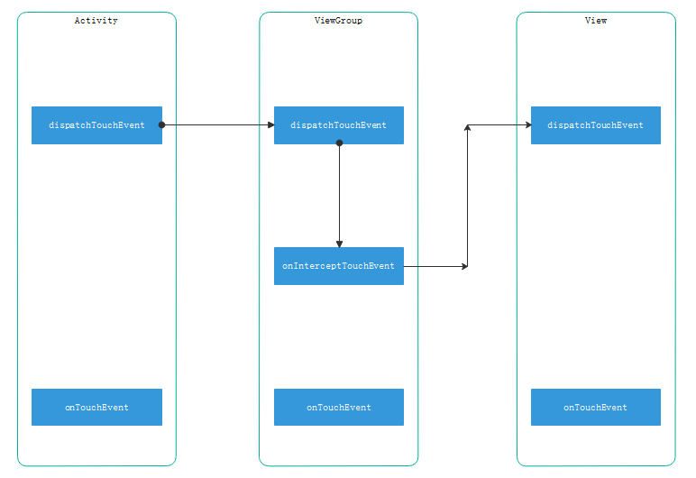

**move/up事件**的传递流程
与down一样

### View的onTouchEvent返回false

**down事件**的传递流程

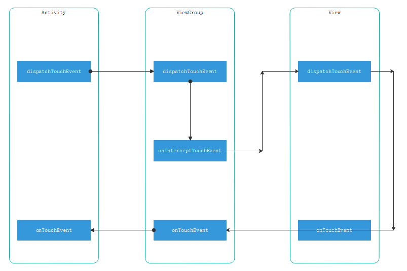

**move/up事件**的传递流程

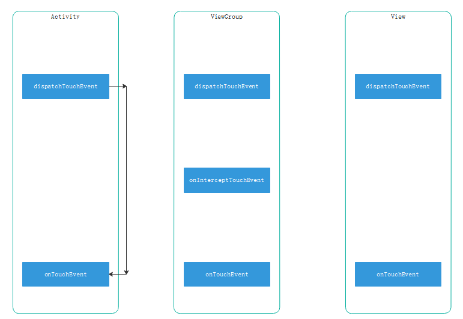

### View的onTouchEvent返回true，ViewGroup的onInterceptTouchEvent的move事件返回true

**down事件**的传递流程

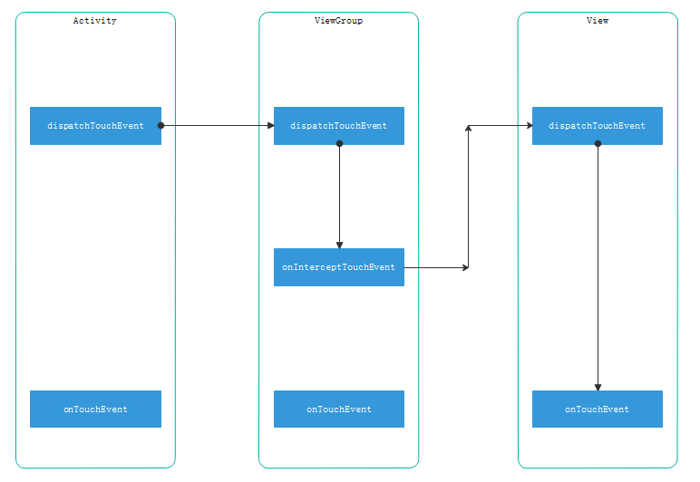

**第一次move事件**的传递流程

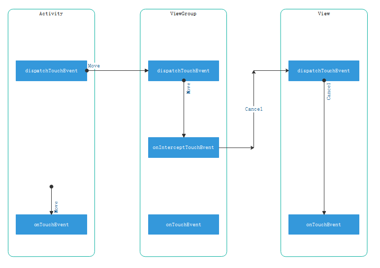

**后续move事件**的传递流程

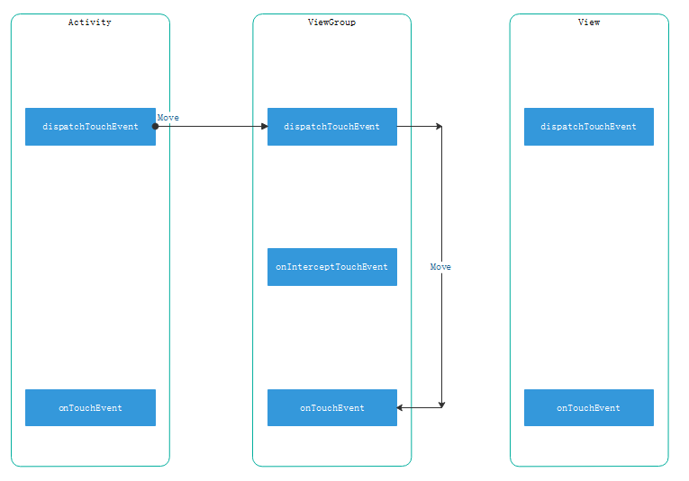


## View源码分析

### dispatchTouchEvent方法


```
public boolean dispatchTouchEvent(MotionEvent event) {
        // If the event should be handled by accessibility focus first.
        if (event.isTargetAccessibilityFocus()) {
            // We don't have focus or no virtual descendant has it, do not handle the event.
            if (!isAccessibilityFocusedViewOrHost()) {
                return false;
            }
            // We have focus and got the event, then use normal event dispatch.
            event.setTargetAccessibilityFocus(false);
        }

        boolean result = false;

        if (mInputEventConsistencyVerifier != null) {
            mInputEventConsistencyVerifier.onTouchEvent(event, 0);
        }

        final int actionMasked = event.getActionMasked();
        if (actionMasked == MotionEvent.ACTION_DOWN) {
            // Defensive cleanup for new gesture
            stopNestedScroll();
        }

        if (onFilterTouchEventForSecurity(event)) {
            //noinspection SimplifiableIfStatement
            ListenerInfo li = mListenerInfo;
            if (li != null && li.mOnTouchListener != null
                    && (mViewFlags & ENABLED_MASK) == ENABLED
                    && li.mOnTouchListener.onTouch(this, event)) {
                //如果设置了OnTouchListener监听器，那么直接返回true，即将当前控件设置为TargetView，
                //且不会执行onTouchEvent方法
                result = true;
            }

            if (!result && onTouchEvent(event)) {
				//如果没有设置OnTouchListener监听器，此时执行onTouchEvent.
                result = true;
            }
        }

        if (!result && mInputEventConsistencyVerifier != null) {
            mInputEventConsistencyVerifier.onUnhandledEvent(event, 0);
        }

        // Clean up after nested scrolls if this is the end of a gesture;
        // also cancel it if we tried an ACTION_DOWN but we didn't want the rest
        // of the gesture.
        if (actionMasked == MotionEvent.ACTION_UP ||
                actionMasked == MotionEvent.ACTION_CANCEL ||
                (actionMasked == MotionEvent.ACTION_DOWN && !result)) {
            stopNestedScroll();
        }
		//若result为true，那么该View后者子View会消费事件
        return result;
    }
```
由以上代码可知：
* OnTouchListener在onTouchEvent之前执行
* OnTouchListener返回true时，表示当前View或者其子View为TargeView，后面的onTouchEvent不会执行。

### onTouchEvent


```
public boolean onTouchEvent(MotionEvent event) {
    ...
    if (mPerformClick == null) {
        mPerformClick = new PerformClick();
     }
    if (!post(mPerformClick)) {
		//在手指弹起时触发点击事件
        performClick();
    }
    ...
```
由上面代码可知：
* 点击事件响应performClick方法时在onTouchEvent中调用的
* 所以触摸监听器OnTouchEvent在点击监听器OnClick之前执行

#### onTouchListener与onClickListener调用时机
以下是事件传递过程（其中MyListView，MyItem是ViweGroup）:
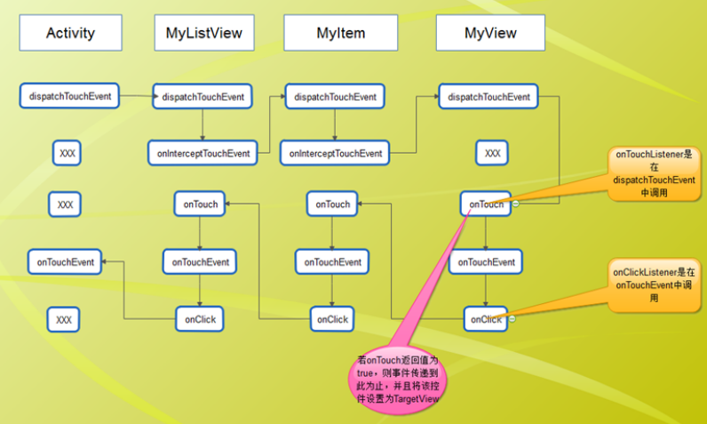

## ViewGroup源码分析

### dispatchTouchEvent

#### 第一部分
```
public boolean dispatchTouchEvent(MotionEvent ev){
    ...
            //检查是否拦截
            final boolean intercepted;
            if (actionMasked == MotionEvent.ACTION_DOWN
                    || mFirstTouchTarget != null) {
                //有requestDisallowIntercept方法确定，当子控件调用该方法时，父控件不做拦截判断
                final boolean disallowIntercept = (mGroupFlags & FLAG_DISALLOW_INTERCEPT) != 0;
                if (!disallowIntercept) {
                    intercepted = onInterceptTouchEvent(ev);
                    ev.setAction(action); // restore action in case it was changed
                } else {
                    intercepted = false;
                }
            } else {
                // There are no touch targets and this action is not an initial down
                // so this view group continues to intercept touches.
                intercepted = true;
            }
    ...
}
```
功能：
* 子控件是否请求了不要拦截事件
* 判断是否需要拦截事件

#### 第二部分


```
    ...
            //每次处理事件之前将目标控件链表置空
            TouchTarget newTouchTarget = null;
    ...
    ...
                    //当目标控件链表为空，或者子控件为空时(即相当于)
                    if (newTouchTarget == null && childrenCount != 0) {
                        final float x = ev.getX(actionIndex);
                        final float y = ev.getY(actionIndex);
                        // Find a child that can receive the event.
                        // Scan children from front to back.
                        //预排序子控件:按照子控件在Z轴的坐标，找出所有能接收该事件的子控件，并从前景到背景的方向遍历这些子控件
                        final ArrayList<View> preorderedList = buildOrderedChildList();
                        final boolean customOrder = preorderedList == null
                                && isChildrenDrawingOrderEnabled();
                        final View[] children = mChildren;
						//倒序遍历子控件
                        for (int i = childrenCount - 1; i >= 0; i--) {
                            final int childIndex = customOrder
                                    ? getChildDrawingOrder(childrenCount, i) : i;
                            final View child = (preorderedList == null)
                                    ? children[childIndex] : preorderedList.get(childIndex);

                            // If there is a view that has accessibility focus we want it
                            // to get the event first and if not handled we will perform a
                            // normal dispatch. We may do a double iteration but this is
                            // safer given the timeframe.
                            if (childWithAccessibilityFocus != null) {
                                if (childWithAccessibilityFocus != child) {
                                    continue;
                                }
                                childWithAccessibilityFocus = null;
                                i = childrenCount - 1;
                            }
							//判断事件触发点是否在该子控件内部，若不在直接下一轮循环
                            if (!canViewReceivePointerEvents(child)
                                    || !isTransformedTouchPointInView(x, y, child, null)) {
                                ev.setTargetAccessibilityFocus(false);
                                continue;
                            }

                            newTouchTarget = getTouchTarget(child);
                            if (newTouchTarget != null) {
                                // Child is already receiving touch within its bounds.
                                // Give it the new pointer in addition to the ones it is handling.
                                newTouchTarget.pointerIdBits |= idBitsToAssign;
                                break;
                            }

                            resetCancelNextUpFlag(child);
							//判断该子控件是否消费该事件
                            if (dispatchTransformedTouchEvent(ev, false, child, idBitsToAssign)) {
                                // Child wants to receive touch within its bounds.
                                mLastTouchDownTime = ev.getDownTime();
                                if (preorderedList != null) {
                                    // childIndex points into presorted list, find original index
                                    for (int j = 0; j < childrenCount; j++) {
                                        if (children[childIndex] == mChildren[j]) {
                                            mLastTouchDownIndex = j;
                                            break;
                                        }
                                    }
                                } else {
                                    mLastTouchDownIndex = childIndex;
                                }
                                mLastTouchDownX = ev.getX();
                                mLastTouchDownY = ev.getY();
                                newTouchTarget = addTouchTarget(child, idBitsToAssign);
                                alreadyDispatchedToNewTouchTarget = true;
                                break;
                            }

                            // The accessibility focus didn't handle the event, so clear
                            // the flag and do a normal dispatch to all children.
                            ev.setTargetAccessibilityFocus(false);
                        }
                        if (preorderedList != null) preorderedList.clear();
                    }

                    if (newTouchTarget == null && mFirstTouchTarget != null) {
                        // Did not find a child to receive the event.
                        // Assign the pointer to the least recently added target.
                        newTouchTarget = mFirstTouchTarget;
                        while (newTouchTarget.next != null) {
                            newTouchTarget = newTouchTarget.next;
                        }
                        newTouchTarget.pointerIdBits |= idBitsToAssign;
                    }
                }
    ...
```

功能：查找消费事件的子View，过程如下：
* 先清空上次的TargetView；
* 将子控件按照Z坐标排序，值越大排在越后面，存入排序好子View集合中；
* 倒序遍历排序后的子View集合
* - 判断事件的x、y坐标是否在该子View的范围内
* - 若在该子View的范围内，且该子控件消费该事件，那么该子View就是TargetView，跳出遍历；否则判断下一个子View；


#### 第三部分


```
// Dispatch to touch targets.
            if (mFirstTouchTarget == null) {
				//没有找到消费该事件的子控件，那么将当前控件作为目标控件，并将事件传递给自己调用super.dispatchTouchEvent
                // No touch targets so treat this as an ordinary view.
                handled = dispatchTransformedTouchEvent(ev, canceled, null,
                        TouchTarget.ALL_POINTER_IDS);
            } else {
                // Dispatch to touch targets, excluding the new touch target if we already
                // dispatched to it.  Cancel touch targets if necessary.
                TouchTarget predecessor = null;
                TouchTarget target = mFirstTouchTarget;
                while (target != null) {
                    final TouchTarget next = target.next;
                    if (alreadyDispatchedToNewTouchTarget && target == newTouchTarget) {
                        handled = true;
                    } else {
                    	//当找到了消费该事件的子控件时，该值置为true
                        final boolean cancelChild = resetCancelNextUpFlag(target.child)
                                || intercepted;
                        if (dispatchTransformedTouchEvent(ev, cancelChild,
                                target.child, target.pointerIdBits)) {
                            //该子控件消费事件
                            handled = true;
                        }
						//若该置为true，表示链表不往下遍历了
                        if (cancelChild) {
                            if (predecessor == null) {
                                mFirstTouchTarget = next;
                            } else {
                                predecessor.next = next;
                            }
                            target.recycle();
                            target = next;
                            continue;
                        }
                    }
                    predecessor = target;
                    target = next;
                }
            }
```
